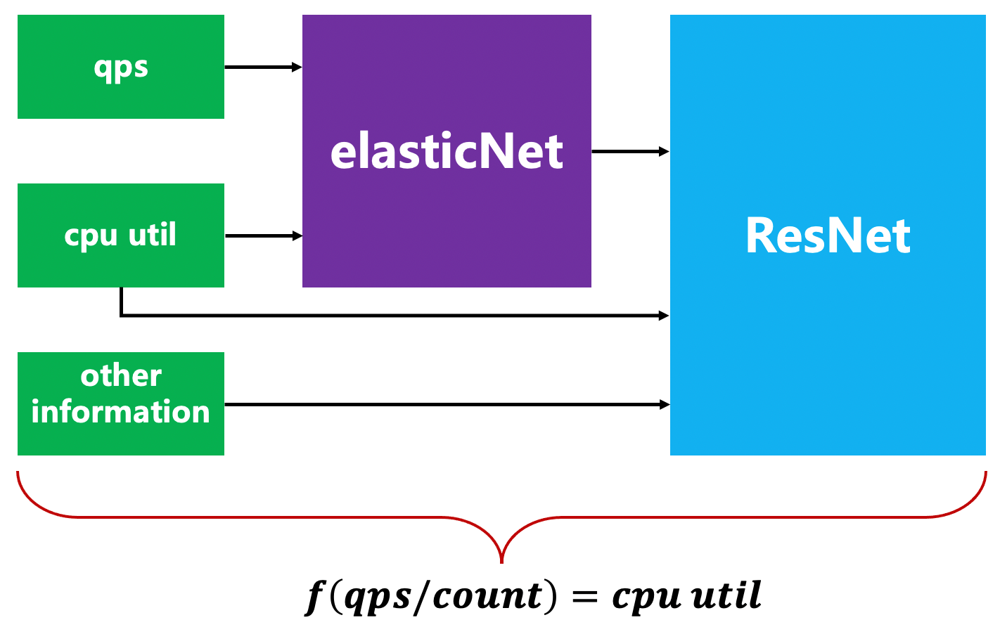
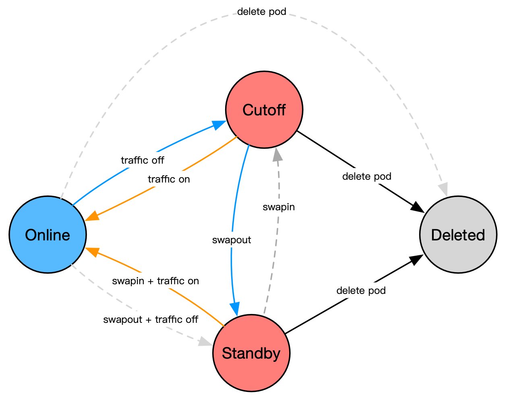

Kapacity is an open cloud native capacity solution which helps you achieve ultimate resource utilization in an
intelligent and risk-free way. It automates your scaling, mitigates capacity risks, saves your effort as well as cost.

Kapacity is built upon core ideas and years of experience of the large-scale production capacity system at Ant Group,
which saves ~100k cores yearly with high stability and zero downtime, combined with best practices from the cloud native
community.

## Core Features

Kubernetes HPA is a common way used to scale cloud native workloads automatically, but it has some BIG limitations
listed below which make it less effective and practical in real world large-scale production use:

- HPA works in a reactive way, which means it would only work AFTER the target metrics exceeding the expected value. It
  can hardly provide rapid and graceful response to traffic peaks, especially for applications with longer startup
  times.
- HPA calculates replica count based on metrics by a simple ratio algorithm, with an assumption that the replica count
  must have a strict linear correlation with related metrics. However, this is not always the case in real world.
  Scaling is a highly risky operation in production, but HPA provides little risk mitigation means other than scaling
  rate
  control.
- HPA is a Kubernetes built-in, well, this is not a limitation literally, but it does limit some functions/behaviors to
  specific Kubernetes versions, and there is no way for end users to extend or adjust its functionality for their own
  needs.

So we build Intelligent HPA (IHPA), an intelligent, risk-defensive, highly adaptive and customizable substitution for
HPA. It has below core features:

### Intelligent Algorithm

Capacity is essentially a data-driven decision-making process, rather than simple scaling. IHPA supports the use of
different algorithms according to local conditions in different scenarios. In addition to cron and reactive algorithms,
it also supports a variety of intelligent algorithms such as predictive, burst, etc. In addition, the algorithm can be
combined to take effect based on customized configuration strategy, so that more service scenarios can be adapted to
make more accurate decisions.

  

Taking the predictive algorithm as an example, in the production environment, the capacity water level of an application
is usually affected by multiple external flows, or even its own scheduled tasks, machine performance, etc., and the relationship
between replicas and resource water level may not be linear. This presents a great challenge to replicas prediction
based on application capacity. So IHPA has introduced a set of predictive algorithms based on machine learning that Ant
Group has honed in its internal large-scale elastic production practice. Time-series prediction of each piece of
traffic, and then use the Linear-Residual Model to comprehensively model these component traffic and application
capacity and the corresponding replicas, and finally infer the recommended number of copies for the application
in the future.

Through this idea of traffic-driven capacity, the algorithm can well deal with complex scenarios such as multi-period
traffic in production, trend-changing traffic, multiple traffic affecting capacity, and capacity has a nonlinear
relationship with the number of copies, with versatility and accuracy. Both.

### Multi-Stage Elastic Scaling

Unlike K8s HPA, which only supports scaling of workloads, IHPA supports fine-grained control of the state of each Pod
under the workload throughout the elastic process, improving elastic efficiency and reducing elastic risks through
flexible Pod state transitions. Currently, Kapacity defines the following Pod states:

- Online: The state of the Pod to provide services normally (Running and Ready), which is also the default
  state of the newly expanded Pod.
- Cutoff: The state in which Pod traffic is completely cut off (Running but Not Ready). In practice, scaling down to
  this state is supported first, supplemented by a stability observation period, and once a problem is found, it can be
  rolled back to the Online state in seconds.
- Standby: Pod resources are swapped out and kept at a low water level. Compared with the Cutoff state, this state can
  actually release the resources occupied by the Pod for use by other applications, and also supports minute-level
  rollback to the Online state.
- Deleted: The status of the Pod being actually deleted. In fact, the Pod itself does not exist in this state.

    

### High Stability

IHPA has absorbed the experience and lessons of Ant Group's large-scale elastic production practice for many years, and
has accumulated a unique ability to guarantee the stability of elastic changes.

#### Grayscale Scaling

IHPA supports the use of custom grayscale batch change strategies when performing expansion and reduction, which
minimizes the explosion radius of elastic changes; at the same time, it also supports adding the Cutoff/Standby
intermediate state mentioned above to achieve multi-stage grayscale , increase the speed of emergency rollback, and
further reduce the risk of elastic changes. The following uses Cutoff as an example of a gray scale reduction in the
intermediate state: the workload of an application originally had 6 Pods, and it is expected to shrink to 2. At this
time, the Pods will be automatically changed to Cutoff in batches according to the user's gray scale configuration.
State, each change will be observed at a certain time interval for stability. After all Pods to be scaled down are
switched to the Cutoff state, they will enter the final additional stability observation period. If no risks are found
in the end, the real scale-in will be performed. If risks are found during the period, they can be quickly rolled back
to the Online state.

#### Stability Check and Change Fuse

In the process of elastic change, sometimes it is impossible to expose risks in time only by observing whether the
elastic indicators are abnormal. Therefore, IHPA Supports user-defined stability checks during the change period,
including custom indicator abnormality judgments, etc., and analyzes the change status in multiple dimensions. Once an
abnormality is found, it supports automatic emergency circuit breaker measures, such as change suspension or change
rollback, to truly achieve elastic changes. Make it unattended.

### Open and Highly Extensible Architecture

- IHPA is split into three independent modules for replica count calculation, workload replicas control and overall
  autoscaling process management. Each module is replaceable and extensible.
- Various extension points are exposed which makes the behavior of IHPA fully customizable and extensible. For example,
  you can customize how to control traffics of the pod, which pods shall be scaled down first, how to detect risks
  during autoscaling and so on.