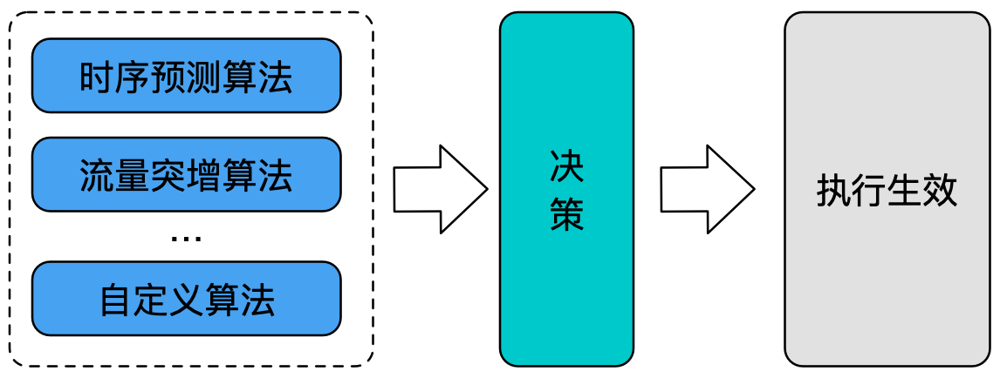
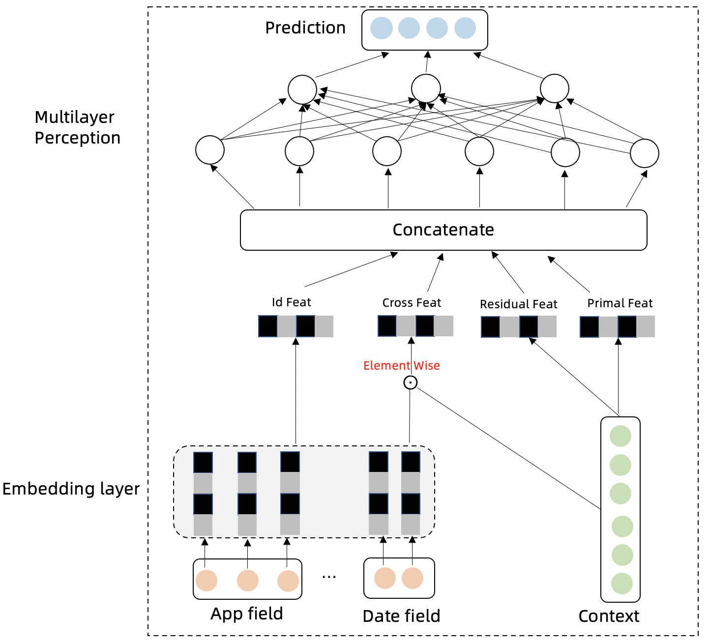

Kapacity 旨在为用户提供一套具备完善技术风险能力的、智能且开放的云原生容量技术，帮助用户安全稳定地实现极致降本增效，解决容量相关问题。

Kapacity 基于蚂蚁集团内部容量系统的核心理念和多年的大规模生产实践经验而构建，该内部容量系统目前已能安全稳定地为蚂蚁持续节省年均约
10w 核的算力成本，同时，Kapacity 也结合了来自云原生社区的最佳实践。

## 核心能力

Kubernetes HPA 是一项用于对云原生工作负载进行自动扩缩容的常见技术，但它在实际大规模生产使用上的效果和实用度上却并不理想，主要由以下几个原因导致：

- HPA 的自动扩缩容通过响应式的方式驱动，仅当应用负载已经超出设定水位时才会触发扩容，此时容量风险已经出现，只能起到应急的作用而非提前规避风险，尤其对于自身启动时间较长的应用，几乎起不到快速应对流量洪峰的作用。
- HPA 通过简单的指标折比来计算扩缩容目标副本数，只适用于应用副本数和相关指标呈严格线性相关的理想场景，但实际生产当中应用的各类指标和副本数之间存在错综复杂的关系，该算法很难得到符合容量水位要求的副本数。
- 容量弹性作为变更故障率较高的一类场景，HPA 除了支持限制扩缩容速率外没有提供任何其他的风险防控手段，在稳定性要求较高的生产环境中大规模落地是很难令人放心的。
- HPA 作为 Kubernetes 内置能力，一方面自然有其开箱即用的好处，但另一方面也使其绑定在了具体的 k8s
  版本上，自身的行为难以被用户扩展或调整，难以满足各类用户在不同应用场景下的定制化需求。

为此，我们构建了 Intelligent HPA (IHPA)，它是一个更加智能化的、具备完善技术风险能力的且高度可扩展定制的 HPA
替代方案。它具有如下几个核心特性：

### 智能弹性算法

容量弹性本质上是一个数据驱动决策的过程，而非简单的扩缩容。除了简单的定时和响应式算法，Kapacity IHPA
支持在不同场景因地制宜地使用不同的算法，除了简单的定时与响应式算法，其还支持多种智能算法如预测式、突增式等，同时支持按自定义配置策略对算法进行组合生效，从而能够适配更多业务场景、扩缩容的决策也更为精准。

    

以预测式算法为例，在生产上，应用的容量水位通常会受到多条外部流量，甚至是自身定时任务、机器性能等的影响，且副本数与容量水位之间的关系也未必是线性，这为基于应用容量的副本数预测带来了很大的挑战。
为此，Kapacity IHPA 引入了蚂蚁在内部大规模弹性生产实践中打磨出的一套基于机器学习的预测式算法，该算法首先通过 Swish Net for
Time Series Forecasting (SNTSF) 对潜在影响应用容量水位的多条流量进行时序预测，随后通过 Linear-Residual Model
将这些组分流量和应用容量及其对应副本数进行综合建模，最终推理得出应用未来的推荐副本数。

通过这种流量驱动容量的思想，该算法能够很好地应对生产上多周期流量、趋势变化流量、多条流量共同影响容量、容量与副本数呈非线性关系等复杂场景，通用性和准确性兼具。

### 多级弹性伸缩

不同于原生 HPA 只支持工作负载扩缩容，IHPA 支持在整个弹性过程中精细化地控制工作负载下每一个 Pod 的状态，通过灵活的
Pod 状态转换提升弹性效率并降低弹性风险。
目前，Kapacity 定义了下面几种 Pod 状态：

- Online：Pod 正常对外提供服务的状态（Running and Ready），也是新扩容 Pod 的默认状态。
- Cutoff：Pod 流量完全摘除的状态（Running but Not Ready）。在实践上，支持优先缩容到此状态，并辅以一段稳定性观察期，一旦发现问题能够秒级回滚到
  Online 状态。
- Standby：Pod 资源被换出，保持在低水位的状态。相比于 Cutoff 状态，该状态能够实际释放 Pod 所占用资源供其他应用使用，也支持分钟级回滚到
  Online 状态。
- Deleted：Pod 被真正删除的状态。实际到了该状态 Pod 本身就不存在了。

    

### 稳定性保障

IHPA 吸收了蚂蚁多年大规模弹性生产实践的经验教训，沉淀出了独有的弹性变更稳定性保障能力。

#### 灰度变更

IHPA 在执行扩缩容时支持采用自定义灰度分批的变更策略，最大程度地减小了弹性变更的爆炸半径；同时还支持加入上文提到的
Cutoff/Standby 中间态实现多阶段灰度，提升应急回滚速度，进一步降低弹性变更风险。
下面以使用 Cutoff 作为中间态的一次灰度缩容为例：某应用的工作负载原来有 6 个 Pod，期望缩容到 2 个，此时会按照用户的灰度配置自动分批变更
Pod 为 Cutoff 状态，每次变更都会间隔一定时间进行稳定性观察。当待缩容 Pod 都切换为 Cutoff
状态后会进入最终的额外稳定性观察期，如果最后没有发现风险则再执行真正的缩容，如果期间发现风险，则能够快速回滚到 Online 状态。

#### 稳定性检查与变更熔断

在弹性变更的过程中，有时候仅仅通过观察弹性指标是否异常无法及时暴露出风险，因此，IHPA
支持用户自定义的变更期稳定性检查，包括自定义指标异常判断等，多维度地分析变更状况，一旦发现异常支持自动采取应急熔断措施，如变更暂停或变更回滚，真正做到弹性变更常态化无人值守。

### 开放扩展

开放可扩展的架构

- 整个 IHPA 能力拆分为了管控、决策、执行三大模块，任一模块都可以做替换或扩展。
- 提供了大量扩展点，使得其行为能够被用户自由扩展或调整。可扩展的部分包括但不限于自定义 Pod 摘挂流的逻辑、自定义 Pod
  缩容优先级、自定义变更期稳定性检查逻辑等。
